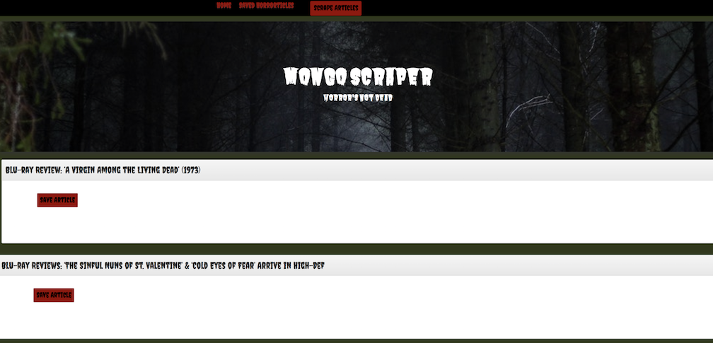
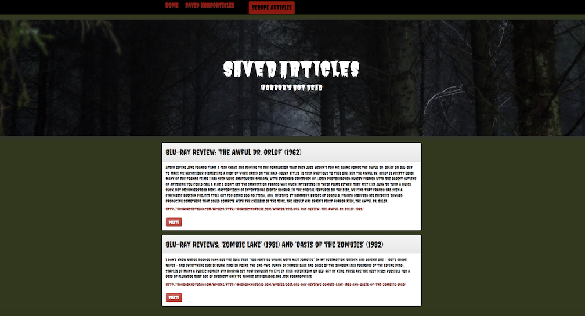

# Mongo-Scraper

## Summary
Mongo Scraper is a web app that lets users view the latest news in the horror world. 

Please check out the deployed version through Heroku: [Mongo Scraper](https://news-notes4u.herokuapp.com/).

## Languages Used
This burger logger is created with 
* Node.js
* Express.js
* Handlebars.js
* MongoDB
* Mongoose
* npm packages
  * body-parser
  * express
  * express-handlebars
  * mongoose
  * cheerio
  * request

## Introduction
Start by clicking the "Scrape Articles" button for a list of current articles from the Horror's Not Dead website.

## Saved Articles
Find a surprisingly disturbing title you'd like to peruse? Click the "Save Article" button, head on over to your Saved Horrorticles page, and check out the article for yourself. You can even navigate to the host website for more information.

